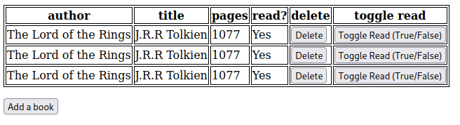
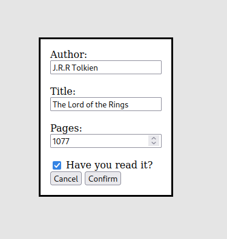
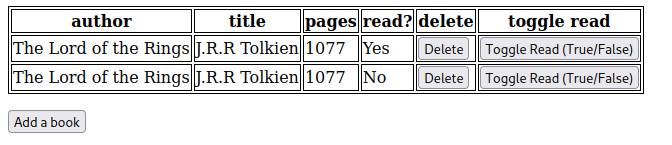

# Basic Library App
## Features:
- Creating, Deleting book records.
- You can update the status of whether you have read a book
- Displays all books on a table

## Images:

## Project purpose:
- This project is just to get familiar with javascript.
